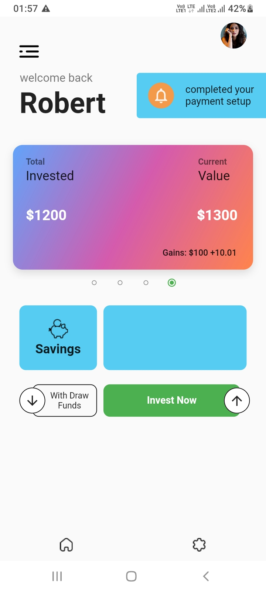
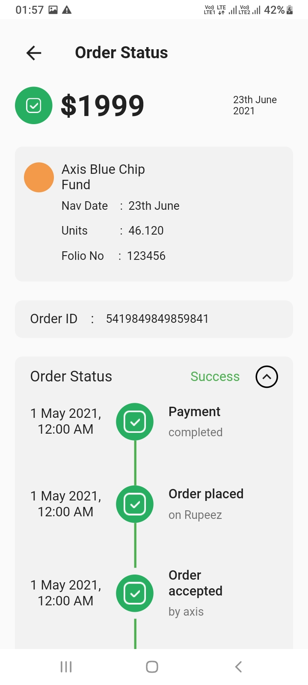

### 
 🙋 Finance App UI Design In Flutter

### 
[🤩 Click Here To Download The App](https://drive.google.com/file/d/1TRfrj9t7stdzdWCCeIEVwygl5JzQ6W7Z/view?usp=sharing)

## Getting Started

This project is a starting point for a Flutter application.

A few resources to get you started if this is your first Flutter project:

- [Lab: Write your first Flutter app](https://flutter.dev/docs/get-started/codelab)
- [Cookbook: Useful Flutter samples](https://flutter.dev/docs/cookbook)

For help getting started with Flutter, view our
[online documentation](https://flutter.dev/docs), which offers tutorials,
samples, guidance on mobile development, and a full API reference.
